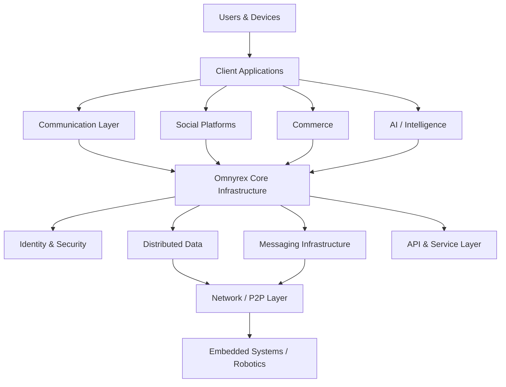

<div align="center">

# ABDULFATTAH

### Founder · Software Engineer · Systems Builder

<a href="https://omnyrex.com">
  
</a>
<a href="https://github.com/Abdulfattah1001">
  
</a>

<br />


</div>

---

## About

I'm a **software engineer and founder** building systems, infrastructure, and products designed for the next generation of the internet.

My primary focus is **[Omnyrex](https://omnyrex.com)** — a technology company building digital infrastructure and intelligent platforms across communication, commerce, social platforms, AI, robotics, and software infrastructure.

I work across the stack, from **system architecture and backend infrastructure to mobile applications, security, networking, and product engineering.**

I enjoy problems where the difficult part isn't writing the code.

It's designing the **system behind the code.**

---

## 🚀 What I'm Building

<table>
<tr>
<td width="50%" valign="top">

### Omnyrex

A technology company building foundational digital infrastructure and platforms for the modern internet economy.

**Focus**

`Communication` · `Commerce` · `Social` · `AI` · `Robotics` · `Infrastructure`

<a href="https://omnyrex.com">

</a>

</td>

<td width="50%" valign="top">

### Omnyrex Messaging

Secure communication infrastructure designed around privacy, performance, and resilient message delivery.

**Engineering**

`E2EE` · `Signal Protocol` · `Real-time Systems` · `Offline Systems`

</td>
</tr>

<tr>
<td width="50%" valign="top">

### Omnyrex Social

A social platform built as part of the broader Omnyrex ecosystem.

**Engineering**

`Mobile` · `Backend` · `Distributed Data` · `Real-time Interaction`

</td>

<td width="50%" valign="top">

### Future Systems

Research and engineering across:

`AI` · `LLMs` · `P2P` · `Networking` · `Robotics` · `Embedded Systems`

</td>
</tr>
</table>

---

# 🧠 Engineering

I don't try to collect technologies.

I try to understand systems.

### Distributed Systems

Designing services that can communicate, synchronize, recover, and scale without depending on a single point of failure.

### Secure Communication

Working with end-to-end encryption, secure message delivery, identity, and privacy-preserving architectures.

### Offline-First Systems

Exploring architectures where applications remain useful even when connectivity is unreliable.

### Networking

Interested in how devices communicate beyond conventional client-server architectures.

### AI Infrastructure

Exploring LLMs, intelligent software systems, agents, and the infrastructure required to operate them reliably.

### Embedded & Robotics

Building toward the intersection of software, hardware, networking, and autonomous systems.

---

# 🏗️ System Architecture

A simplified view of the kind of ecosystem I'm interested in building:




### Long-Term Direction

The long-term goal is not simply to build individual applications.

It is to develop shared digital infrastructure that enables multiple products, services, and platforms to operate as part of a connected ecosystem.

This approach allows capabilities such as identity, communication, data, security, intelligence, and other foundational services to be developed once and extended across multiple products.

---

⚙️ Technology

Languages

- Java
- Kotlin
- Go
- C++
- JavaScript

Backend & Systems

- Spring
- REST APIs
- XMPP
- WebSockets
- Distributed Systems
- Linux
- Docker

Mobile

- Android
- Jetpack Compose
- Room
- Android Networking

Security & Communication

- Signal Protocol
- End-to-End Encryption
- Real-Time Messaging
- Secure Communication
- Identity & Authentication

Exploring

- Large Language Models
- AI Infrastructure
- Peer-to-Peer Systems
- Networking
- ESP32 & Embedded Systems
- Robotics

---

###  📊 GitHub

I use GitHub primarily as an engineering workspace for building, experimenting, and documenting systems.


<div align="center">


</div><br><div align="center">

</div>

---

## 🌐 Socials:
[](https://instagram.com/aminuabdulfattah) [](https://twitter.com/@aminuabdulfatt3) 

---

 <!--START_SECTION:waka-->

```txt
Java              18 hrs 10 mins        ████████████████░░░░░░░░░   64.32 %
Kotlin            6 hrs 4 mins          █████▒░░░░░░░░░░░░░░░░░░░   21.52 %
JavaScript        1 hr 12 mins          █░░░░░░░░░░░░░░░░░░░░░░░░   04.27 %
Markdown          57 mins               █░░░░░░░░░░░░░░░░░░░░░░░░   03.38 %
SQL               36 mins               ▓░░░░░░░░░░░░░░░░░░░░░░░░   02.18 %
```

<!--END_SECTION:waka-->


# 📊 GitHub Stats:
<br/>
<br/>


# 🔬 Areas of Exploration

My current engineering interests span several interconnected areas:

## Distributed Systems

Designing systems that can operate across multiple services, devices, and environments while maintaining reliability and consistency.

## Secure Communication

Exploring privacy-preserving communication systems, end-to-end encryption, secure identity, and resilient message delivery.

### Offline & Peer-to-Peer Systems

Investigating architectures that allow applications and devices to communicate and remain useful when traditional network connectivity is limited.

## Intelligent Software

Exploring how AI can become an integral part of software platforms, rather than functioning only as a standalone interface.

## AI & LLM Infrastructure

Studying the systems, architectures, and infrastructure required to build reliable intelligent applications around modern language models.

## Embedded Systems

Working with microcontrollers, networking, sensors, and hardware to understand the intersection between software and physical systems.

## Robotics

Exploring autonomous systems where software, intelligence, hardware, and real-world interaction converge.

---

# 🧩 The Bigger Picture

These areas are not isolated interests.

They represent different layers of a larger engineering direction:

Software → Networks → Intelligence → Hardware → Infrastructure

The long-term objective is to bring these layers together into systems capable of supporting multiple products and services through shared infrastructure.

Omnyrex

Digital Infrastructure · Intelligent Platforms · Communication · Commerce · Social · AI · Robotics